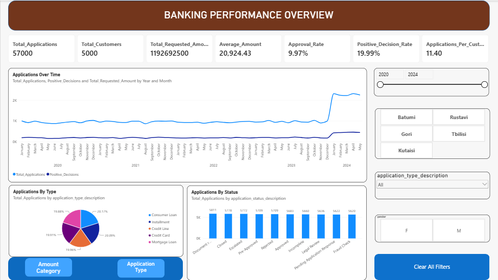
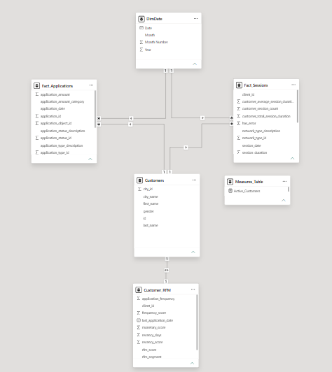
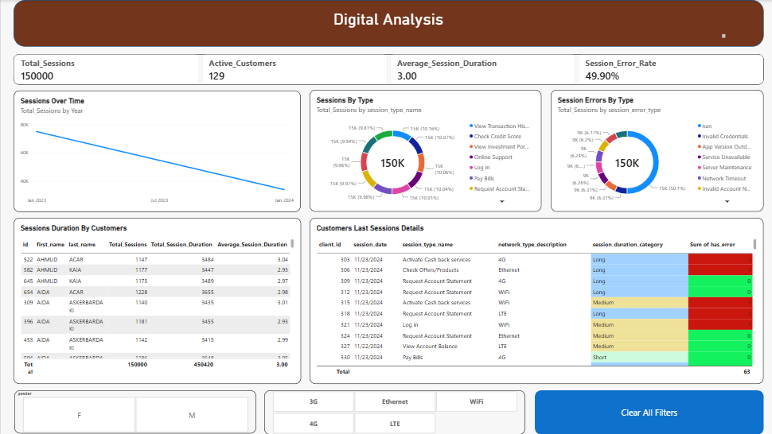
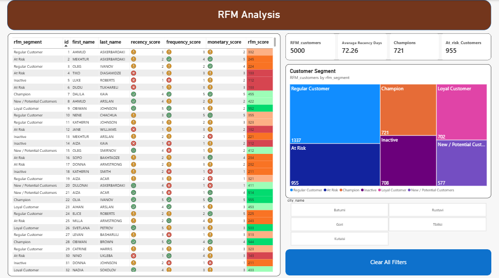

# Banking Customer Analytics & RFM Segmentation Dashboard

## Project Overview

This project analyzes customer behavior within a banking environment using **SQL** and **Power BI**. The solution combines traditional banking application data, digital banking activity, and customer segmentation through **RFM Analysis (Recency, Frequency, Monetary)** to generate actionable business insights.



The objective is to help banking stakeholders understand customer engagement, application performance, digital channel usage, and customer value segmentation.

---

## Business Objectives

The project aims to answer several key business questions:

* Which customer groups generate the highest value?
* Which customers are at risk of becoming inactive?
* How are banking applications performing over time?
* What digital banking services are most frequently used?
* How engaged are customers across digital channels?
* Which customer segments require retention strategies?

---

## Technologies Used

| Tool          | Purpose                                               |
| ------------- | ----------------------------------------------------- |
| SQL Server    | Data extraction, transformation, and RFM calculations |
| Power BI      | Dashboard development and visualization               |
| DAX           | KPI calculations and business metrics                 |
| Data Modeling | Star schema design and relationship management        |

---

## Data Model

The solution is built using a star-schema model consisting of:

### Fact Tables

* Fact_Applications
* Fact_Sessions

### Dimension Tables

* Customers
* DimDate

### Analytical Tables

* Customer_RFM
* Measures_Table

### Relationship Structure

The model connects customer activity, banking applications, and digital session behavior through shared customer and date dimensions, enabling cross-functional analysis across multiple business domains.



---

# Dashboard 1: Banking Performance Overview

## Purpose

Provides a high-level view of banking application performance and customer activity.

### Key Metrics

* Total Applications
* Total Customers
* Total Requested Amount
* Average Requested Amount
* Approval Rate
* Positive Decision Rate
* Applications Per Customer

### Analysis Included

* Application trends over time
* Application status distribution
* Application type distribution
* Geographic analysis by city
* Customer demographics

### Business Value

This dashboard helps management monitor lending activity, approval efficiency, and customer demand patterns.


---

# Dashboard 2: Digital Banking Analysis

## Purpose

Analyzes customer interaction with digital banking services.

### Key Metrics

* Total Sessions
* Active Customers
* Average Session Duration
* Session Error Rate

### Analysis Included

* Session trends over time
* Most frequently used digital services
* Session error categories
* Customer digital engagement
* Network usage analysis
* Customer activity details

### Business Value

This dashboard identifies customer behavior patterns, service adoption rates, and potential issues impacting user experience.



---

# Dashboard 3: RFM Customer Segmentation

## Purpose

Segments customers based on their purchasing and banking behavior using the RFM framework.

### RFM Components

### Recency

How recently a customer interacted with the bank.

### Frequency

How often a customer engages with banking products and services.

### Monetary

The overall value generated by the customer.

---

## Customer Segments

The project classifies customers into the following groups:

| Segment                  | Description                                       |
| ------------------------ | ------------------------------------------------- |
| Champion                 | Most valuable and highly engaged customers        |
| Loyal Customer           | Frequent customers with strong engagement         |
| New / Potential Customer | Recently acquired customers with growth potential |
| Regular Customer         | Stable customer base                              |
| At Risk                  | Customers showing declining activity              |
| Inactive                 | Customers with little or no recent engagement     |

---

## Key Dashboard Metrics

* Total RFM Customers: 5,000
* Average Recency: 72.26 Days
* Champions: 721
* At Risk Customers: 955

### Segment Distribution

The treemap visualization provides an overview of customer distribution across RFM segments, enabling targeted marketing and retention strategies.



---

## SQL Workflow

### Data Preparation

* Data Cleaning
* Customer Aggregation
* Date Transformations

### Analytical Processing

* RFM Metric Calculation
* Customer Scoring
* Customer Segmentation Logic

### SQL Concepts Used

* CTEs
* Aggregate Functions
* CASE Statements
* Window Functions
* Joins
* Ranking Functions
* Views

---

## Power BI Features

### Interactive Filtering

Users can analyze data by:

* Year
* City
* Gender
* Application Type
* Network Type
* Customer Segment

### Visualizations

* KPI Cards
* Line Charts
* Bar Charts
* Treemaps
* Donut Charts
* Detailed Tables
* Interactive Slicers

---

## Key Insights

### Customer Segmentation

* Champions represent a high-value customer group that should be prioritized for retention.
* At-risk customers account for a significant portion of the customer base and may require targeted engagement campaigns.

### Banking Applications

* Application volumes remain stable with noticeable growth in recent periods.
* Approval and decision rates provide insight into lending efficiency.

### Digital Banking

* Customers actively use multiple digital services.
* Error-rate monitoring helps identify opportunities for improving digital user experience.

---

## Business Recommendations

### Retain High-Value Customers

Develop loyalty and rewards programs for Champion and Loyal Customer segments.

### Re-engage At-Risk Customers

Launch personalized marketing campaigns and retention initiatives.

### Improve Digital Experience

Investigate high-frequency error categories and optimize customer journeys.

### Increase Product Adoption

Target New/Potential Customers with cross-selling and educational campaigns.

---

## Repository Structure

```text
Customers-RFM-Analysis/
│
├── SQL/
│   ├── Data_Cleaning.sql
│   ├── RFM_Analysis.sql
│   ├── Banking_Analysis.sql
│   └── Digital_Analysis.sql
│
├── PowerBI/
│   └── Banking_Customer_Analytics.pbix
│
├── Images/
│   ├── Banking_Overview.png
│   ├── Digital_Analysis.png
│   ├── RFM_Analysis.png
│   └── Relations.png
│
└── README.md
```

---

## Skills Demonstrated

* SQL Analytics
* Data Modeling
* Customer Segmentation
* Business Intelligence
* Power BI Dashboard Design
* KPI Development
* Data Visualization
* Banking Analytics
* Customer Behavior Analysis

---

## Author

**Nutsa Dzagnidze**

GitHub: https://github.com/Nutsik0

LinkedIn: www.linkedin.com/in/nutsa-dzagnidze-9b545119a


